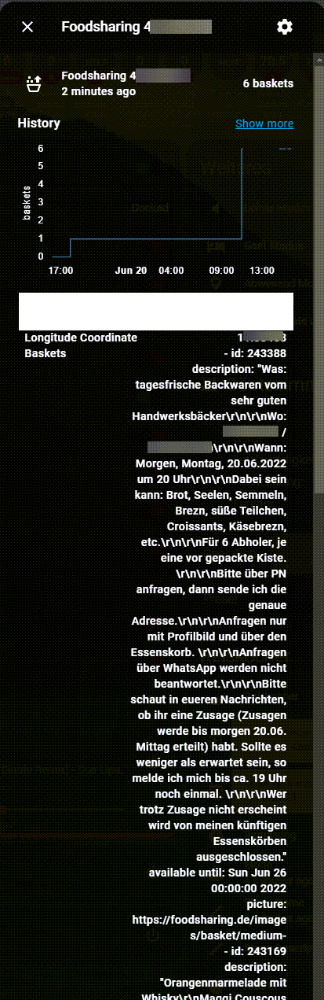

[](https://github.com/hacs/integration)
# Foodsharing.de Homeassistant Sensor
Gets foodsharing baskets from the [foodsharing.de API](https://beta.foodsharing.de/api/doc/).





This integration provides the following informations with a refresh rate of 2 minutes until now:


Sensors:

- sensor.foodsharing_latitudeCoordinate: How many baskets are available within your distance range

Sensor Attributes:

- id: Basket ID
- description: Description text about the basket
- address: Human readable detailed address, fetched from coordinates
- maps: Google Maps Link to basket
- available until: time until basket creator says it could be available
- picture: link

## Installation
### 1. Using HACS (recommended way)

Open your HACS Settings and add

https://github.com/faserf/ha-foodsharing

as custom repository URL.

Then install the "Foodsharing.de" integration.

If you use this method, your component will always update to the latest version.

### 2. Manual

- Download the latest zip release from [here](https://github.com/FaserF/ha-foodsharing/releases/latest)
- Extract the zip file
- Copy the folder "foodsharing" from within custom_components with all of its components to `<config>/custom_components/`

where `<config>` is your Home Assistant configuration directory.

>__NOTE__: Do not download the file by using the link above directly, the status in the "master" branch can be in development and therefore is maybe not working.

## Configuration

Go to Configuration -> Integrations and click on "add integration". Then search for Foodsharing.de

### Configuration Variables
- **latitude**: Enter your Latitude
- **longitude**: Enter your Longitude
- **distance**: The search distance for baskets in kilometers
- **email**: Your Foodsharing.de E-Mail address
- **password**: Your Foodsharing.de Password
- **update interval**: Custom refresh time interval in minutes (not working for the moment)

### Basket URL
To use a basket URL in automations you can use the following code for example:

```yaml
Link: https://foodsharing.de/essenskoerbe/{{ state_attr('sensor.foodsharing_latitude', 'baskets')[0]['id'] }}
```

A full automation example for HA would be:

```yaml
message: >
    
        There is {{ states.sensor.foodsharing_latitude.state }} foodsharing basket available.
    
        There are {{ states.sensor.foodsharing_latitude.state }} foodsharing baskets available.
    

    Newest one: {{ state_attr('sensor.foodsharing_latitude', 'baskets')[0]['description'] }}

    ------------

    Available until: {{ state_attr('sensor.foodsharing_latitude', 'baskets')[0]['available until'] }}

    
        [Picture]({{ state_attr('sensor.foodsharing_latitude', 'baskets')[0]['picture'] }})
    

    [Link](https://foodsharing.de/essenskoerbe/{{ state_attr('sensor.foodsharing_latitude', 'baskets')[0]['id'] }})

    
        address: {{ state_attr('sensor.foodsharing_latitude', 'baskets')[0]['address'] }}

        [Google Maps Link]({{ state_attr('sensor.foodsharing_latitude', 'baskets')[0]['maps'] }})
    
```

## Bug reporting
Open an issue over at [github issues](https://github.com/FaserF/ha-foodsharing/issues). Please prefer sending over a log with debugging enabled.

To enable debugging enter the following in your configuration.yaml

```yaml
logger:
    logs:
        custom_components.foodsharing: debug
```

You can then find the log in the HA settings -> System -> Logs -> Enter "foodsharing" in the search bar -> "Load full logs"

## Thanks to
Huge thanks to [@knorr3](https://github.com/knorr3) for his help and the [coronavirus integration](https://github.com/knorr3/coronavirus_germany), where this integration structure is based on!