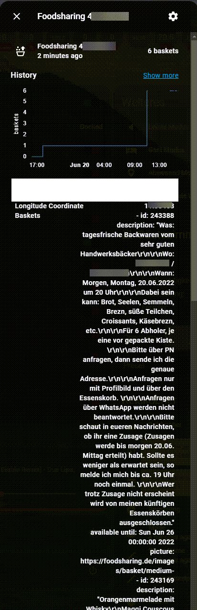

[](https://github.com/hacs/integration)
[](https://github.com/FaserF/ha-foodsharing/releases)

# Foodsharing.de Home Assistant Integration 🧺

A comprehensive [Home Assistant](https://www.home-assistant.io/) custom integration for [Foodsharing.de](https://foodsharing.de/) — monitor nearby food baskets, fairteiler locations, pickup schedules, messages, and notifications directly from your smart home dashboard. This integration utilizes the official Foodsharing.de API.

<p align="center">
  
  <br>
  
</p>

---

## Features ✨

| Feature | Description |
|---------|-------------|
| 🧺 **Basket Sensor** | Monitor the number of available food baskets near your location, with full details as attributes |
| 📍 **Geo-Location** | Baskets and Fairteiler points displayed on the HA map with calculated distances |
| 📅 **Pickup Calendar** | Your upcoming pickups shown as calendar events |
| 🔔 **Notifications Sensor** | Track unread bell notifications |
| 💬 **Messages Sensor** | Track unread conversation messages |
| 🔘 **Basket Buttons** | Request nearby baskets or close your own baskets with one tap |
| 🔧 **Service Calls** | `foodsharing.request_basket` service for use in automations |
| 🌍 **Multi-Location** | Add the integration multiple times with different search areas |
| 🔑 **Keyword Matching** | Filter baskets by keywords and get events when matches are found |
| 🩺 **HA Repairs** | Automatic repair notifications for authentication failures or API outages |
| 📊 **Diagnostics** | Built-in diagnostics support with automatic redaction of sensitive data |
| 🌐 **Translations** | Full English and German translations |

---

## ❤️ Support This Project

> I maintain this integration in my **free time alongside my regular job** — bug hunting, new features, testing on real devices. Test hardware costs money, and every donation helps me stay independent and dedicate more time to open-source work.
>
> **This project is and will always remain 100% free.** There are no "Premium Upgrades", paid features, or subscriptions. Every feature is available to everyone.
>
> Donations are completely voluntary — but the more support I receive, the less I depend on other income sources and the more time I can realistically invest into these projects. 💪

<div align="center">

[](https://github.com/sponsors/FaserF)&nbsp;&nbsp;
[](https://paypal.me/FaserF)

</div>

---

## Installation 🛠️

### 1. Using HACS (Recommended)

This integration is available in the **HACS Default Repository**.

1. Open HACS.
2. Search for **"Foodsharing"**.
3. Click **Download**.
4. Restart Home Assistant.

[](https://my.home-assistant.io/redirect/hacs_repository/?owner=FaserF&repository=ha-foodsharing&category=integration)

### 2. Manual Installation

1. Download the latest [Release](https://github.com/FaserF/ha-foodsharing/releases/latest).
2. Extract the ZIP file.
3. Copy the `foodsharing` folder to `<config>/custom_components/`.
4. Restart Home Assistant.

---

## Configuration ⚙️

1. Go to **Settings** → **Devices & Services**.
2. Click **Add Integration**.
3. Search for **"Foodsharing.de"**.
4. Enter your credentials and select a location on the map.

### Configuration Options

| Option | Description | Default |
|--------|-------------|---------|
| **Email** | Your Foodsharing.de account email | *required* |
| **Password** | Your Foodsharing.de account password | *required* |
| **Location** | Pin on the map to set your search center | HA home location |
| **Search Radius** | Derived from the map circle radius (in km) | 7 km |
| **Keywords** | Comma-separated filter keywords (optional) | *empty* |
| **Scan Interval** | How often to poll the API (in minutes) | 2 min |

> [!TIP]
> You can add the integration multiple times with different locations to monitor several areas at once.

All options can be changed later via **Settings → Devices & Services → Foodsharing → Configure**.

---

## Entities Created 📋

### Sensors

| Entity | Type | State | Attributes |
|--------|------|-------|------------|
| `sensor.foodsharing_baskets_*` | Sensor | Number of nearby baskets | `baskets` (list), `basket_count`, `latitude`, `longitude` |
| `sensor.foodsharing_unread_messages` | Sensor | Number of unread messages | — |
| `sensor.foodsharing_notifications` | Sensor | Number of unread bell notifications | — |

### Geo-Location Entities

| Entity | Type | State |
|--------|------|-------|
| `geo_location.basket_*` | Geo-Location | Distance from search center (km) |
| `geo_location.fairteiler_*` | Geo-Location | Distance from search center (km) |

### Calendar

| Entity | Type | Description |
|--------|------|-------------|
| `calendar.foodsharing_pickups` | Calendar | Your scheduled pickup events |

### Buttons

| Entity | Type | Description |
|--------|------|-------------|
| `button.foodsharing_<entry_id>_loc_<idx>_request_basket_<slot>` | Button | **Dynamic**: Requests the N-th available basket at the location. These entities are created dynamically based on the current number of nearby baskets. |
| `button.foodsharing_<email>_close_basket_<slot>` | Button | **Dynamic**: Closes the N-th own active basket. These entities are created dynamically based on your own active baskets. |

### Services

| Service | Description | Fields |
|---------|-------------|--------|
| `foodsharing.request_basket` | Request a basket by ID | `basket_id` (required), `email` (optional) |
| `foodsharing.close_basket` | Close your own active basket by ID | `basket_id` (required), `email` (optional) |

---

## Basket Sensor Attributes 📦

The basket sensor exposes the full list of baskets as the `baskets` attribute. Each basket in the list contains:

| Key | Description | Example |
|-----|-------------|---------|
| `id` | Basket ID | `123456` |
| `description` | Basket description text | `"Fresh bread and vegetables"` |
| `available_until` | When the basket expires | `"Sun Feb 23 18:00:00 2025"` |
| `picture` | Image URL (or `null`) | `"https://foodsharing.de/images/..."` |
| `latitude` | Basket latitude | `48.1234` |
| `longitude` | Basket longitude | `11.5678` |
| `maps` | Google Maps link | `"https://www.google.com/maps/..."` |
| `keyword_match` | Whether it matches your keywords | `true` / `false` |

---

## Events 🔔

The integration fires custom events that you can use as automation triggers:

| Event | Description | Data |
|-------|-------------|------|
| `foodsharing_keyword_match` | A new basket matches your keywords | Full basket data |
| `foodsharing_new_message` | A new unread message arrived | `conversation_id`, `message` |
| `foodsharing_new_bell` | A new bell notification | Bell data |
| `foodsharing_fairteiler_post` | New post on a fairteiler wall | `fairteiler_id`, `fairteiler_name`, `post` |

---

## HA-Whatsapp Support

> [!TIP]
> This integration works perfectly with the [Home Assistant WhatsApp Integration](https://github.com/FaserF/ha-whatsapp) by the same author!

---

## Automation Examples 🤖

<details>
<summary><b>📬 Professional Basket Notification (Telegram/Mobile)</b></summary>

This robust example triggers when the basket count *increases* and handles missing data gracefully. **Note:** For Telegram, the picture link is placed first to ensure it's used for the message preview.

```yaml
automation:
  - alias: "Foodsharing: New baskets available"
    trigger:
      - platform: state
        entity_id: sensor.foodsharing_baskets_48_1180_11_6833
    condition:
      - condition: template
        value_template: >
          
          
          {{ to_state > from_state }}
    action:
      - service: telegram_bot.send_message
        data:
          target: !secret telegram_group_id
          parse_mode: html
          message: |
            
            
              
              
              🖼️ <a href="{{ b.picture }}">Preview Image</a>
              

              🧺 <b>NEW FOOD BASKET FROM {{ b.user_name | upper | e }} AVAILABLE</b>

              <b>Description:</b>
              {{ b.description | e }}

              
              ⏰ <b>Available until:</b> {{ b.available_until | e }}
              

              ---
              
              📍 <a href="{{ b.maps }}">Open in Google Maps</a>
              
              
              🔗 <a href="https://foodsharing.de/essenskoerbe/{{ b.id }}">Open on Foodsharing.de</a>

              ⚖️ <a href="https://wiki.foodsharing.network/wiki/Verhaltensregeln:Verhaltensregeln_-_Erl%C3%A4uterungen#B)_Verhalten_bei_Abholungen">Foodsharing Conduct Rules</a>
            
```

</details>

<details>
<summary><b>🔑 Detailed Keyword Match Notification</b></summary>

Reacts to the `foodsharing_keyword_match` event for instant notifications including all available data.

```yaml
automation:
  - alias: "Foodsharing: Keyword match found"
    trigger:
      - platform: event
        event_type: foodsharing_keyword_match
    action:
      - service: notify.mobile_app_your_phone
        data:
          title: "🎯 Foodsharing Keyword Match!"
          message: >
            From {{ trigger.event.data.user_name }}: {{ trigger.event.data.description }}
            
            (Until {{ trigger.event.data.available_until }})
            
          data:
            
            image: "{{ trigger.event.data.picture }}"
            
            clickAction: "https://foodsharing.de/essenskoerbe/{{ trigger.event.data.id }}"
```

</details>

<details>
<summary><b>📋 Detailed basket notification with image</b></summary>

```yaml
automation:
  - alias: "Foodsharing: Detailed basket alert"
    trigger:
      - platform: numeric_state
        entity_id: sensor.foodsharing_baskets_48_1180_11_6833
        above: 0
    action:
      - service: notify.mobile_app_your_phone
        data:
          title: "🧺 Foodsharing Basket Available"
          message: >-
            
            
              
              {{ b.description }}

              Available until: {{ b.available_until }}

              
              Maps: {{ b.maps }}
              

              Link: https://foodsharing.de/essenskoerbe/{{ b.id }}
            
          data:
            image: >-
              
              
                {{ baskets[0].picture }}
              
```

</details>

<details>
<summary><b>💬 New message notification</b></summary>

```yaml
automation:
  - alias: "Foodsharing: New message received"
    trigger:
      - platform: event
        event_type: foodsharing_new_message
    action:
      - service: notify.mobile_app_your_phone
        data:
          title: "💬 Foodsharing Message"
          message: "You have a new unread message on Foodsharing.de!"
```

</details>

<details>
<summary><b>🔔 Bell notification</b></summary>

```yaml
automation:
  - alias: "Foodsharing: New notification"
    trigger:
      - platform: numeric_state
        entity_id: sensor.foodsharing_notifications
        above: 0
    action:
      - service: notify.mobile_app_your_phone
        data:
          title: "🔔 Foodsharing"
          message: >-
            You have {{ states('sensor.foodsharing_notifications') }} unread notification(s).
```

</details>

<details>
<summary><b>📅 Pickup reminder (1 hour before)</b></summary>

```yaml
automation:
  - alias: "Foodsharing: Pickup reminder"
    trigger:
      - platform: calendar
        event: start
        offset: "-01:00:00"
        entity_id: calendar.foodsharing_pickups
    action:
      - service: notify.mobile_app_your_phone
        data:
          title: "📅 Upcoming Pickup"
          message: >-
            Don't forget your bags! "{{ trigger.calendar_event.summary }}" starts in 1 hour.
```

</details>

<details>
<summary><b>🏪 Detailed Fairteiler Update</b></summary>

Notifies you about new posts on a Fairteiler wall (e.g., "Fairteiler is full").

```yaml
automation:
  - alias: "Foodsharing: Fairteiler status update"
    trigger:
      - platform: event
        event_type: foodsharing_fairteiler_post
    action:
      - service: telegram_bot.send_message
        data:
          target: !secret telegram_group_id
          parse_mode: html
          message: |
            📢 <b>NEW ENTRY AT FAIRTEILER</b>
            
            🏫 <b>Location:</b> {{ trigger.event.data.fairteiler_name | e }}
            👤 <b>From:</b> {{ (trigger.event.data.post.user_name if trigger.event.data.post.user_name else 'Unknown') | e }}

            <b>Message:</b>
            {{ trigger.event.data.post.body | e }}

            ---
            🔗 <a href="https://foodsharing.de/fairteiler/{{ trigger.event.data.fairteiler_id }}">Open Fairteiler on Foodsharing.de</a>
            ⚖️ <a href="https://wiki.foodsharing.network/wiki/Verhaltensregeln:Verhaltensregeln_-_Erl%C3%A4uterungen#B)_Verhalten_bei_Abholungen">Conduct Rules</a>
```

</details>

<details>
<summary><b>🔧 Request a basket via service call</b></summary>

```yaml
automation:
  - alias: "Foodsharing: Auto-request keyword match"
    trigger:
      - platform: event
        event_type: foodsharing_keyword_match
    action:
      - service: foodsharing.request_basket
        data:
          basket_id: "{{ trigger.event.data.id }}"
```

</details>

---

## Blueprints 📘

A ready-to-use **Pickup Reminder** blueprint is included in the `blueprints/` folder. To install it:

1. Copy `blueprints/automation/foodsharing/pickup_reminder.yaml` to your HA `blueprints/automation/` directory.
2. Go to **Settings → Automations → Blueprints** and configure it.

---

## HA Repairs 🩺

The integration uses Home Assistant's built-in **Repairs** system to notify you of problems:

| Issue | When it appears | What to do |
|-------|----------------|------------|
| **Authentication failed** | Your password was changed or credentials expired | Go to integration options and update email/password |
| **API offline** | Foodsharing.de returns a 503 error | Wait — data resumes automatically when the API recovers |

Repair items appear in **Settings → System → Repairs**.

---

## Bug Reporting 🐛

Open an issue at [GitHub Issues](https://github.com/FaserF/ha-foodsharing/issues). Please include a log with debugging enabled.

To enable debug logging, add this to your `configuration.yaml`:

```yaml
logger:
  logs:
    custom_components.foodsharing: debug
```

Then find the log at **Settings → System → Logs** → search for `foodsharing` → **Load full logs**.

---

## API Documentation 📖

This integration is built on the **official Foodsharing.de API**. For more information, technical details, or to explore available endpoints for testing, visit the official [Foodsharing DevDocs](https://devdocs.foodsharing.de).

---

## Thanks to 🙏

A huge thanks to the great IT Team from [Foodsharing](https://devdocs.foodsharing.de) for their easy to use API and great docs, which made this integration possible!